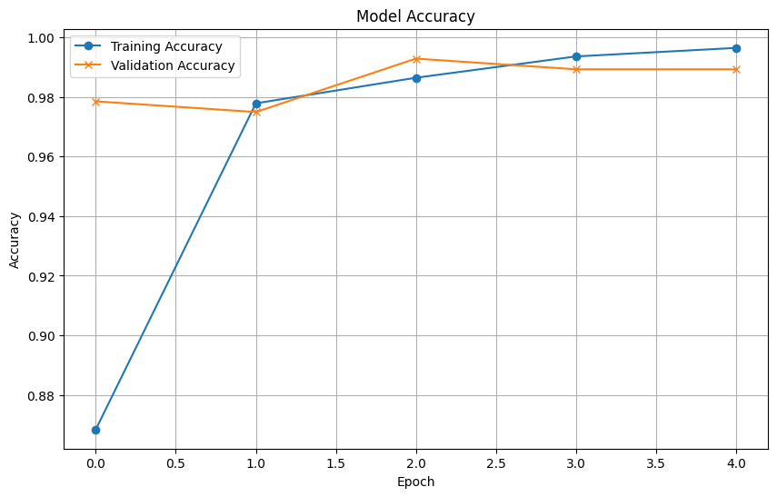
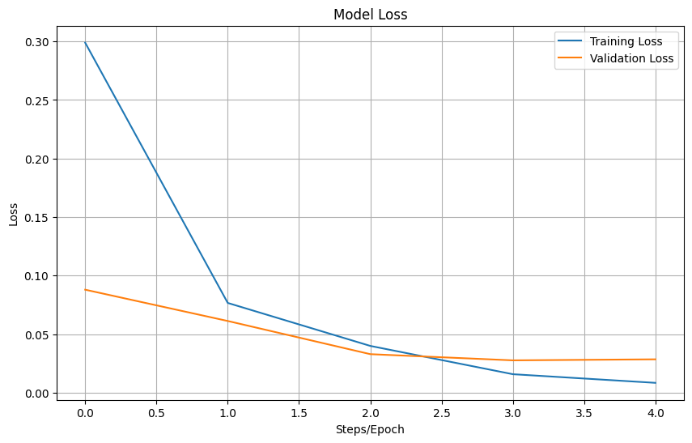
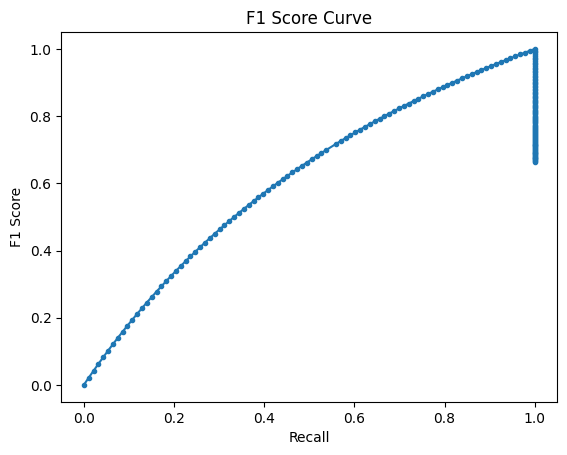
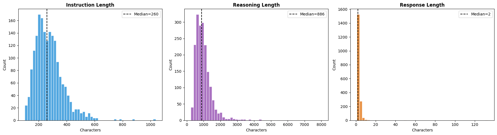

# Self-Improving Math Reasoning Agent

## Project Overview
While Large Language Models (LLMs) exhibit strong generation capabilities, they frequently produce flawed reasoning chains containing logical or mathematical errors. This project introduces a **Reasoning Evaluation Pipeline** designed to tackle this reliability gap. It utilizes a two-stage architecture where reasoning outputs generated by a baseline LLM are automatically evaluated and classified by a secondary "Critic" model strictly trained to detect hallucinations and logical missteps.

## Repository Layout
```text
.
├── backend/
│   ├── Data/              # Raw and processed evaluation datasets
│   ├── Notebooks/         # Data engineering & inference utility scripts
│   ├── Reports/           # Evaluation metric figures (Accuracy, F1, Loss, etc.)
│   ├── Trained_Weights/   # Serialized DeBERTa-v3 .keras weights
│   ├── main.py            # FastAPI application entry point
│   ├── config.py          # Environment configuration loader
│   └── requirements.txt   # Python backend dependencies
├── frontend/
│   ├── app/               # Next.js 16 App Router code (API proxy, Pages)
│   ├── components/        # Isolated React UI blocks (ReasoningBlock)
│   ├── package.json       # Node.js frontend dependencies
│   └── globals.css        # Tailwind v4 configuration & base styles
├── Dockerfile             # Hugging Face deployment container specifications
└── .gitattributes         # Git LFS definitions for tracking large weights
```

## Data Collection and Preparation

### Dataset Sources
The project utilizes publicly available reasoning datasets, including:
- GSM8K (Grade School Math Reasoning Dataset).
- Synthetic reasoning error datasets generated during the project.

These datasets provide structured reasoning tasks that include questions, reasoning steps, and correct answers.

### Data Preparation
The following preprocessing steps were performed:
1. **Data Cleaning:** Removal of incomplete or inconsistent entries, and elimination of duplicated samples.
2. **Synthetic Error Generation:** Creation of incorrect reasoning samples by modifying correct reasoning chains, labeling reasoning errors such as mathematical errors, logical errors, and missing reasoning steps.
3. **Data Formatting:** The final dataset follows a structured format: `Question`, `Reasoning`, `Answer`, `Label (Correct / Error Type)`.

### Data Quality Assurance
To ensure dataset reliability, missing values are handled appropriately, reasoning steps are validated for consistency, and balanced samples of correct and incorrect reasoning are stringently maintained.

## Model Selection and Implementation
Two AI models are implemented in the proposed system.

### 1. Reasoning Generation Model
The first model generates reasoning-based answers for input questions. While initially designed for fine-tuning on small open-source language models (such as TinyLlama or Phi-2), the current scalable implementation effectively utilizes highly-capable endpoint models (Groq LLaMA integration) to parse complex math pipelines robustly and cleanly structure the output logic.

### 2. Critic Model (Reasoning Error Detector)
The critic model analyzes reasoning outputs and classifies whether the reasoning contains errors. In this pipeline, a lightweight transformer model—specifically fine-tuned using a DeBERTa-v3 architecture via Keras-Hub—is used for granular classification accuracy.

### Implementation Tools
The project is implemented using the following technologies:
- **Programming Language:** Python, TypeScript
- **AI Frameworks:** TensorFlow, Keras (Keras-Hub), HuggingFace Transformers, HuggingFace Datasets
- **Frontend / Backend:** Next.js, FastAPI, Uvicorn

## System Architecture

The project boasts a thoroughly decoupled architecture spread across a modern Next.js 16 UI and a heavy-lifting FastAPI inference backend.

**API Gateway (Backend)**
- Orchestrates the multi-stage pipeline, intercepts errors, and serves serialized payload metrics securely to the Web Tier. 
- Bootstraps the unigram SentencePiece tokenizer and the deserialized `keras-hub` model checkpoint into RAM for sub-second classification.

**Web UI (Frontend)**
- Client-side application using Tailwind CSS for premium responsive styling.
- Integrates Framer Motion to animate sequential loading states, Reasoning dropdown elements, and pipeline progress visualization dynamically.

## Model Training and Evaluation

### Model Training
The reasoning generation model is prompted on reasoning datasets to generate structured reasoning chains. The critic model is trained using labeled reasoning samples that indicate whether the provided reasoning is correct or incorrect.

### Evaluation Metrics
The system is evaluated using standard machine learning performance metrics:
- **Reasoning Model Evaluation:** Reasoning accuracy, Answer correctness.
- **Critic Model Evaluation:** Accuracy, Precision, Recall, F1-score.
These metrics successfully measure how effectively the critic model detects reasoning errors.

### Cross Validation
To ensure model robustness and generalization, cross-validation techniques are heavily applied, and the training and testing datasets are kept strictly separated.

## Model Performance Metrics

The DeBERTa Critic was intricately fine-tuned over rigorous datasets. Below are the key metric reports showcasing our optimal modeling performance.

**Model Accuracy & Loss**
These plots map out the exponential stability and convergence of the agent throughout epoch traversals:
| Accuracy | Loss |
|:---:|:---:|
|  |  |

**Predictive Validation & Data Shape**
Statistical analysis mapping confusion scores alongside F1 derivation:
| Confusion Matrix | F1 Score Curve |
|:---:|:---:|
|  |  |

**Dataset Distribution**
Distributions mitigating input context limits to ensure sequence trimming constraints (`max_sequence_length=512`) are cleanly accommodated without excessive loss of reasoning tokens:
| Tokens vs Character Lengths | Class Distribution |
|:---:|:---:|
|  |  |


## How to Run Locally

### 1. Backend (FastAPI + AI Engine)
Provide your API Key securely matching the runtime environment logic:
```bash
cd backend
python -m venv .venv
source .venv/bin/activate  # (or .venv\Scripts\activate on Windows)

# Install Dependencies
pip install -r requirements.txt
pip install fastapi uvicorn[standard] tensorflow-cpu keras-hub sentencepiece

# Run Server
uvicorn main:app --reload --host 127.0.0.1 --port 8000
```

### 2. Frontend (Next.js)
In a secondary terminal tab:
```bash
cd frontend
echo 'BACKEND_URL="http://127.0.0.1:8000"' > .env.local

# Install UI Dependencies
npm install
npm run dev
```
Navigate to `http://localhost:3000` to interact with the Reasoning Pipeline.

## Hugging Face Space Deployment

The entire pipeline is Docker hardened and natively compatible with Hugging Face Spaces free-tier constraints. 
1. Maintain your source code safely on GitHub by inserting `backend/Trained_Weights/*.keras` inside `.gitignore` due to standard GitHub LFS 2GB restrictions.
2. Create a Hugging Face Space (SDK -> Docker -> Blank). 
3. Deploy local context directly into HF leveraging up to 50 GB caps:
   ```bash
   git remote add huggingface https://huggingface.co/spaces/<your-username>/<your-space-name>
   git push huggingface main
   ```
4. Ensure `GROQ_API_KEY` is inputted into the Space secure Secrets tab. Everything else is orchestrated gracefully via the included Dockerfile!